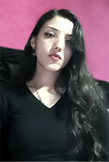

# -PV-LOBOS-SALVAJES
## Miembros del Equipo

### 1. Valentina Leal Lopez

- **Rol en la industria:** Artista de efectos de sonido
- **Ubicación:** La Calera, Cundinamarca
- **Perfil:** Mi nombre es Valentina Leal, tengo 27 años, estoy en noveno semestre de ingenieria multimedia, soy una persona creativa, me gusta la naturaleza y la musica.

## Tatiana Guevara

**Rol en la industria:** Desarrolladora Frontend  
**Ubicación:** Bogotá, Colombia  
**Perfil:** Apasionada por construir interfaces limpias y accesibles.  

# 13_LOBOS_SALVAJES

1. ## Nombre: Daniela Katerin Acosta Wilches. 

2. **Rol en la industria de los videojuegos:** Gameplay animator. 

3. **Ubicacion:**  Bogotá, Colombia. 

4. **Perfil:**  Soy estudiante de ingeniera multimedia en octavo semestre en la UNAD. Estoy enfocada en todo lo relacionado ccon la multimedia pero me dedico especialmente en el area audiovisual, en diseño, modelado, animacion 2d/3d y motion graphics, dando vida y movimiento a objetos y personajes.  Mi principal interes, es realizar productos multimedia educativos, entrentenidos, atractivos e inovadores para el publico, logrando impactar en la audiencia de manera significativa a traves de cualquier exposiscion multimedia como lo son los videojuegos, modelados 3d, animaciones, diseños graficos, peliculas, presentaciones interactivas, audiovisual interactivo, fotografia, audio, paginas web, aplicaciones, entre otras.

  

- **Nombre:** Diego Andres Meneses Arenas  
- **Rol en la industria:** Environment Artist 
- **Ubicación:** Bogotá, Colombia  
- **Perfil:** Soy estudiante de Ingeniería en Multimedia en la UNAD, actualmente cursando séptimo semestre. Apasionado por el arte digital, los videojuegos y el diseño 3D. Me especializo en modelado de entornos, props y personajes, con experiencia en texturizado realista y cartoon. Me interesa combinar la tecnología con la creatividad para generar proyectos innovadores en educación y entretenimiento.  

